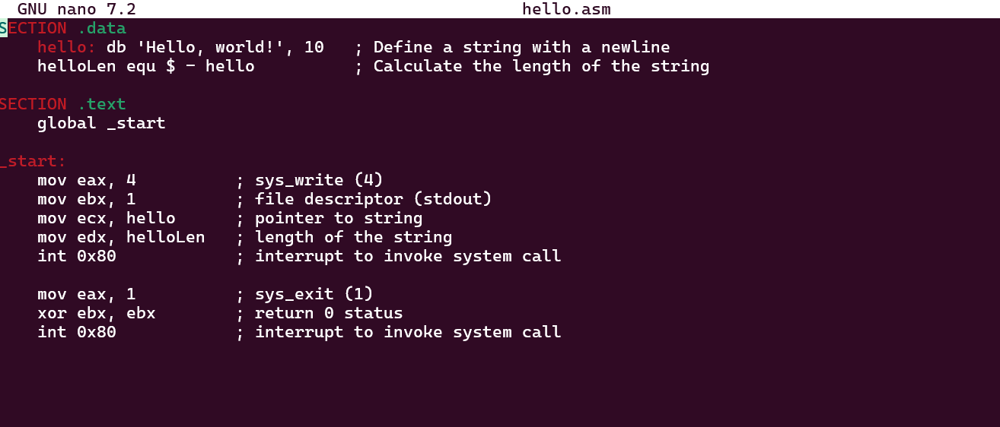
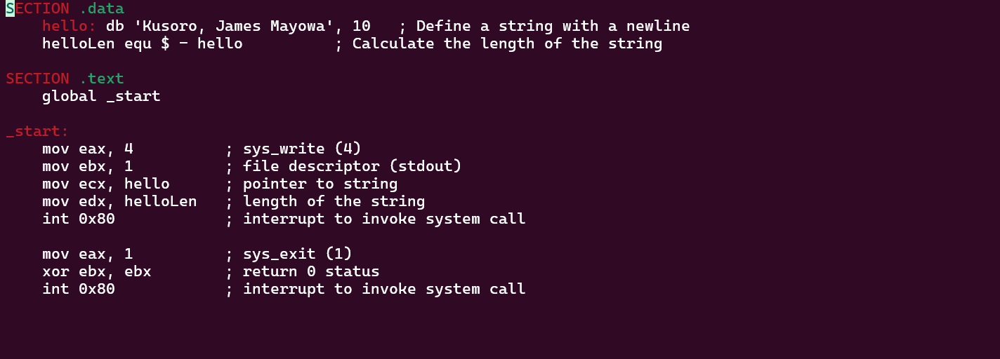
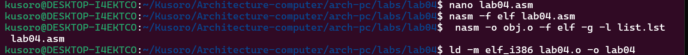

# **Лабораторный отчет No4**
**Кусоро Майова Джеймс**
**Лаб 04**

## **Цель работы**
**Освоение процедуры компиляции и сборки программ, написанных на ассемблере NASM.**

### **Описание задачи**
Процесс создания ассемблерной программы можно изобразить на следующей схеме

**В процессе создания ассемблерной программы можно выделить четыре шага:**
** Набор текста** - программы в текстовом редакторе и сохранение её в отдельном файле.
Каждый файл имеет свой тип (или расширение), который определяет назначение файла.
Файлы с исходным текстом программ на языке ассемблера имеют тип asm.
** Трансляция** — преобразование с помощью транслятора, например nasm, текста про-
граммы в машинный код, называемый объектным. На данном этапе также может быть
получен листинг программы, содержащий кроме текста программы различную допол-
нительную информацию, созданную транслятором. Тип объектного файла — o, файла
листинга — lst.
** Компоновка или линковка** — этап обработки объектного кода компоновщиком (ld),
который принимает на вход объектные файлы и собирает по ним исполняемый файл.
Исполняемый файл обычно не имеет расширения. Кроме того, можно получить файл
карты загрузки программы в ОЗУ, имеющий расширение map.
**Запуск программы** -  Конечной целью является работоспособный исполняемый файл.
Ошибки на предыдущих этапах могут привести к некорректной работе программы,
поэтому может присутствовать этап отладки программы при помощи специальной
программы — отладчика. При нахождении ошибки необходимо провести коррекцию
программы, начиная с первого шага.

1. **Заходим в папку, в которой хотим создать файл .asm и с помощью команды touch report.asm записываем в нее следующий текст**

2. **NASM превращает текст программы в объектный код. Например, для компиляции приве-дённого выше текста программы «Hello World» необходимо
 написать** :nasm -f elf hello.asm

3. **Выполните следующую команду**: nasm -o obj.o -f elf -g -l list.lst hello.asm

Данная команда скомпилирует исходный файл hello.asm в obj.o (опция -o позволяет 
задать имя объектного файла, в данном случае obj.o), при этом формат выходного файла 
будет elf, и в него будут включены символы для отладки (опция -g), кроме того, будет создан файл листинга list.lst (опция -l).

4.**Объектный файл должен быть передан компоновщику для обработки с помощью команды**:ld -m elf_i386 hello.o -o hello

5.**Запустить на выполнение созданный исполняемый файл, находящийся в текущем каталоге,можно, набрав в командной строке**:./hello

 
#### **Самостоятельное задание**
Используя то, что я узнал, я скопировал файл hello.asm в report.asm, а затем с помощью текстового редактора изменил текст программы на мое
 полное имя вместо "Hello world". после того как я перевел полученный текст программы lab04.asm в объектный файл и окончательно связал
 объектный файл, Затем запустили исполняемый файл, Изображения ниже:

**Выход:Из этой лабораторной работы я понял, как компилировать и собирать программы с помощью NASM Assembler**

**Ссылка на официальный сайт** [Github](https://github.com/Ushie47/Laboratory-work.git)

 
